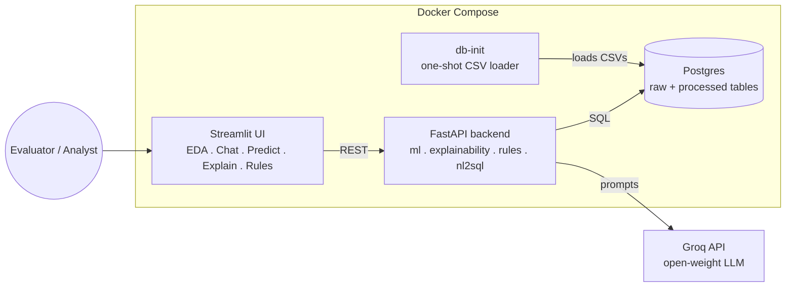

# AI-Powered Credit Risk Intelligence Platform

End-to-end platform on the [Home Credit Default Risk](https://www.kaggle.com/competitions/home-credit-default-risk/data)
dataset: EDA → ML risk scoring → explainability → business rules →
NL-to-SQL chatbot → multi-section UI, fully dockerized.

> **Status:** scaffold complete (repo structure, Docker orchestration, DB
> loader, API/UI skeleton with working health checks). ML, NL-to-SQL,
> explainability, and rules modules are being built next — see
> [Roadmap](#roadmap).

## Architecture

**Why this shape:**
- **Separate `db-init` service** rather than loading data inside the API
  container — keeps the API stateless/restartable and makes the one-time
  ingestion step explicit and idempotent (`docker-compose up` is safe to
  re-run).
- **Postgres as the queryable layer** — the NL-to-SQL chatbot needs a real
  SQL surface, not just pandas DataFrames in memory.
- **Groq (free tier, open-weight models)** for the LLM layer instead of a
  local Ollama container — no GPU requirement on the evaluator's machine,
  while still using open-source model weights (Llama 3.1) rather than a
  closed API. Swappable via `LLM_PROVIDER` in `.env` if you'd rather run
  Ollama locally.

## Repository structure